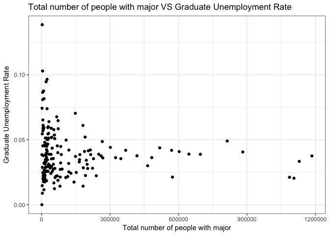
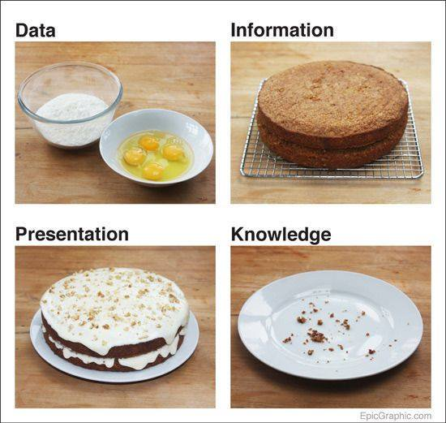

## 1. Create R Markdown Document


## 2. Get some data


```r
install.packages("devtools")
devtools::install_github("rudeboybert/fivethirtyeight")
```

Load `fivethirtyeight` package, I choose `college_grad_student` dataset-- The raw data behind the story "The Economic Guide To Picking A College Major" on [fivethirtynight websit](https://fivethirtyeight.com/features/the-economic-guide-to-picking-a-college-major/)


Manually create a small table for your dataframe with two columns: variable name and variable description. Include a few variables in the table.

```r
name <- c('major_code',
           'major',
           'major_category',
           'grad_total',
           'grad_sample_size',
           'grad_employed',
           'grad_employed_fulltime_yearround',
           'grad_unemployed',
           'grad_unemployment_rate')


decription <- c('Major code, FO1DP in ACS PUMS',
'Major description',
'Category of major from Carnevale et al',
'Total number of people with major',
'Sample size (unweighted) of full-time, year-round ONLY (used for earnings)',
'Number employed (ESR == 1 or 2)',
'Employed at least 50 weeks (WKW == 1) and at least 35 hours (WKHP >= 35)',
'Number unemployed (ESR == 3)',
'Unemployed / (Unemployed + Employed)')
des <- data.frame(name, decription)
names(des) <- c("Variable Name", "Varibale Description")
knitr::kable(des)
```


Variable Name                      Varibale Description                                                       
---------------------------------  ---------------------------------------------------------------------------
major_code                         Major code, FO1DP in ACS PUMS                                              
major                              Major description                                                          
major_category                     Category of major from Carnevale et al                                     
grad_total                         Total number of people with major                                          
grad_sample_size                   Sample size (unweighted) of full-time, year-round ONLY (used for earnings) 
grad_employed                      Number employed (ESR == 1 or 2)                                            
grad_employed_fulltime_yearround   Employed at least 50 weeks (WKW == 1) and at least 35 hours (WKHP >= 35)   
grad_unemployed                    Number unemployed (ESR == 3)                                               
grad_unemployment_rate             Unemployed / (Unemployed + Employed)                                       

## 3.Show the data

Provide a simple summary of the data with `summary()` command.


```
##    major_code      major           major_category       grad_total     
##  Min.   :1100   Length:173         Length:173         Min.   :   1542  
##  1st Qu.:2403   Class :character   Class :character   1st Qu.:  15284  
##  Median :3608   Mode  :character   Mode  :character   Median :  37872  
##  Mean   :3880                                         Mean   : 127672  
##  3rd Qu.:5503                                         3rd Qu.: 148255  
##  Max.   :6403                                         Max.   :1184158  
##  grad_sample_size grad_employed    grad_employed_fulltime_yearround
##  Min.   :   22    Min.   :  1008   Min.   :   770                  
##  1st Qu.:  314    1st Qu.: 12659   1st Qu.:  9894                  
##  Median :  688    Median : 28930   Median : 22523                  
##  Mean   : 2251    Mean   : 94037   Mean   : 72861                  
##  3rd Qu.: 2528    3rd Qu.:109944   3rd Qu.: 80794                  
##  Max.   :21994    Max.   :915341   Max.   :703347                  
##  grad_unemployed grad_unemployment_rate   grad_p25th      grad_median    
##  Min.   :    0   Min.   :0.00000        Min.   : 65000   Min.   : 47000  
##  1st Qu.:  453   1st Qu.:0.02607        1st Qu.: 93000   1st Qu.: 65000  
##  Median : 1179   Median :0.03665        Median :108000   Median : 75000  
##  Mean   : 3506   Mean   :0.03934        Mean   :112087   Mean   : 76756  
##  3rd Qu.: 3329   3rd Qu.:0.04805        3rd Qu.:130000   3rd Qu.: 90000  
##  Max.   :35718   Max.   :0.13851        Max.   :294000   Max.   :135000  
##    grad_p75th    nongrad_total     nongrad_employed 
##  Min.   :24500   Min.   :   2232   Min.   :   1328  
##  1st Qu.:45000   1st Qu.:  20564   1st Qu.:  15914  
##  Median :50000   Median :  68993   Median :  50092  
##  Mean   :52597   Mean   : 214720   Mean   : 154554  
##  3rd Qu.:60000   3rd Qu.: 184971   3rd Qu.: 129179  
##  Max.   :85000   Max.   :2996892   Max.   :2253649  
##  nongrad_employed_fulltime_yearround nongrad_unemployed
##  Min.   :    980                     Min.   :     0    
##  1st Qu.:  11755                     1st Qu.:   880    
##  Median :  38384                     Median :  3157    
##  Mean   : 120737                     Mean   :  8486    
##  3rd Qu.: 103629                     3rd Qu.:  7409    
##  Max.   :1882507                     Max.   :136978    
##  nongrad_unemployment_rate nongrad_p25th   nongrad_median  
##  Min.   :0.00000           Min.   :25000   Min.   : 37000  
##  1st Qu.:0.04198           1st Qu.:34000   1st Qu.: 48700  
##  Median :0.05103           Median :38000   Median : 55000  
##  Mean   :0.05395           Mean   :40078   Mean   : 58584  
##  3rd Qu.:0.06439           3rd Qu.:44000   3rd Qu.: 65000  
##  Max.   :0.16091           Max.   :80000   Max.   :126000  
##  nongrad_p75th      grad_share       grad_premium    
##  Min.   : 48000   Min.   :0.09632   Min.   :-0.0250  
##  1st Qu.: 72000   1st Qu.:0.26757   1st Qu.: 0.2308  
##  Median : 80000   Median :0.39875   Median : 0.3208  
##  Mean   : 84333   Mean   :0.40059   Mean   : 0.3285  
##  3rd Qu.: 97000   3rd Qu.:0.49912   3rd Qu.: 0.4000  
##  Max.   :215000   Max.   :0.93117   Max.   : 1.6471
```


Use the command datatable from the package `DT` to show an interactive table. 
<!--html_preserve--><div id="htmlwidget-e42e7a3dad445a852241" style="width:100%;height:auto;" class="datatables html-widget"></div>
<script type="application/json" data-for="htmlwidget-e42e7a3dad445a852241">{"x":{"filter":"none","data":[["1","2","3","4","5","6","7","8","9","10","11","12","13","14","15","16","17","18","19","20","21","22","23","24","25","26","27","28","29","30","31","32","33","34","35","36","37","38","39","40","41","42","43","44","45","46","47","48","49","50","51","52","53","54","55","56","57","58","59","60","61","62","63","64","65","66","67","68","69","70","71","72","73","74","75","76","77","78","79","80","81","82","83","84","85","86","87","88","89","90","91","92","93","94","95","96","97","98","99","100","101","102","103","104","105","106","107","108","109","110","111","112","113","114","115","116","117","118","119","120","121","122","123","124","125","126","127","128","129","130","131","132","133","134","135","136","137","138","139","140","141","142","143","144","145","146","147","148","149","150","151","152","153","154","155","156","157","158","159","160","161","162","163","164","165","166","167","168","169","170","171","172","173"],[5601,6004,6211,2201,2001,3201,6206,1101,2101,1904,6005,5701,2504,1903,5901,2107,6299,2599,2503,6099,5301,6203,5503,6212,2106,6204,6200,6105,2100,1901,6202,2502,1902,6104,2500,6201,6000,6107,2105,2403,4000,5102,1100,1302,3401,5403,6003,1303,6007,2901,4101,6207,2419,1105,6209,6210,3302,6001,6205,2501,2102,6103,1102,1301,5504,2499,3604,4007,1401,1106,3202,2400,5098,2406,2407,2416,2307,5507,5500,1103,6109,1199,2414,3402,1104,2412,2411,5206,2417,4005,6006,6199,6100,4001,4002,5501,2306,6110,2408,4901,5006,2399,2402,5401,2304,5205,3801,2300,6002,2314,2601,2413,5502,5404,3301,2312,5004,6108,2603,5200,1501,5000,5002,2405,2401,6402,5599,3701,3702,2602,2311,3700,5506,5505,2410,3699,5299,2415,2309,5005,6403,2409,4006,2313,2418,5402,2305,2308,3606,4801,2310,3602,3600,5001,5003,3608,2404,3501,3603,3607,3609,5007,3611,5201,3601,3605,5008,6102,5203,5202,6106,2303,2301],["Construction Services","Commercial Art And Graphic Design","Hospitality Management","Cosmetology Services And Culinary Arts","Communication Technologies","Court Reporting","Marketing And Marketing Research","Agriculture Production And Management","Computer Programming And Data Processing","Advertising And Public Relations","Film Video And Photographic Arts","Electrical, Mechanical, And Precision Technologies And Production","Mechanical Engineering Related Technologies","Mass Media","Transportation Sciences And Technologies","Computer Networking And Telecommunications","Miscellaneous Business &amp; Medical Administration","Miscellaneous Engineering Technologies","Industrial Production Technologies","Miscellaneous Fine Arts","Criminal Justice And Fire Protection","Business Management And Administration","Criminology","Management Information Systems And Statistics","Computer Administration Management And Security","Operations Logistics And E-Commerce","General Business","Medical Technologies Technicians","Computer And Information Systems","Communications","Actuarial Science","Electrical Engineering Technology","Journalism","Medical Assisting Services","Engineering Technologies","Accounting","Fine Arts","Nursing","Information Sciences","Architectural Engineering","Multi/Interdisciplinary Studies","Nuclear, Industrial Radiology, And Biological Technologies","General Agriculture","Forestry","Liberal Arts","Human Services And Community Organization","Visual And Performing Arts","Natural Resources Management","Studio Arts","Family And Consumer Sciences","Physical Fitness Parks Recreation And Leisure","Finance","Petroleum Engineering","Plant Science And Agronomy","Human Resources And Personnel Management","International Business","Composition And Rhetoric","Drama And Theater Arts","Business Economics","Engineering And Industrial Management","Computer Science","Health And Medical Administrative Services","Agricultural Economics","Environmental Science","Geography","Miscellaneous Engineering","Ecology","Interdisciplinary Social Sciences","Architecture","Soil Science","Pre-Law And Legal Studies","General Engineering","Multi-Disciplinary Or General Science","Civil Engineering","Computer Engineering","Mining And Mineral Engineering","Early Childhood Education","Sociology","General Social Sciences","Animal Sciences","Treatment Therapy Professions","Miscellaneous Agriculture","Mechanical Engineering","Humanities","Food Science","Industrial And Manufacturing Engineering","Geological And Geophysical Engineering","Social Psychology","Naval Architecture And Marine Engineering","Mathematics And Computer Science","Art History And Criticism","Miscellaneous Health Medical Professions","General Medical And Health Services","Intercultural And International Studies","Nutrition Sciences","Economics","Physical And Health Education Teaching","Community And Public Health","Electrical Engineering","Theology And Religious Vocations","Oceanography","Miscellaneous Education","Biological Engineering","Public Administration","Elementary Education","Industrial And Organizational Psychology","Military Technologies","General Education","Music","Art And Music Education","Linguistics And Comparative Language And Literature","Materials Engineering And Materials Science","Anthropology And Archeology","Social Work","English Language And Literature","Teacher Education: Multiple Levels","Geology And Earth Science","Pharmacy Pharmaceutical Sciences And Administration","Other Foreign Languages","Psychology","Area Ethnic And Civilization Studies","Physical Sciences","Atmospheric Sciences And Meteorology","Chemical Engineering","Aerospace Engineering","History","Miscellaneous Social Sciences","Applied Mathematics","Statistics And Decision Science","French German Latin And Other Common Foreign Language Studies","Social Science Or History Teacher Education","Mathematics","Political Science And Government","International Relations","Environmental Engineering","Miscellaneous Biology","Miscellaneous Psychology","Metallurgical Engineering","Secondary Teacher Education","Geosciences","United States History","Engineering Mechanics Physics And Science","Cognitive Science And Biopsychology","Language And Drama Education","Nuclear Engineering","Public Policy","Mathematics Teacher Education","Science And Computer Teacher Education","Microbiology","Philosophy And Religious Studies","Special Needs Education","Botany","Biology","Astronomy And Astrophysics","Chemistry","Physiology","Biomedical Engineering","Library Science","Molecular Biology","Pharmacology","Zoology","Physics","Neuroscience","Educational Psychology","Biochemical Sciences","Genetics","Materials Science","Communication Disorders Sciences And Services","Counseling Psychology","Clinical Psychology","Health And Medical Preparatory Programs","School Student Counseling","Educational Administration And Supervision"],["Industrial Arts &amp; Consumer Services","Arts","Business","Industrial Arts &amp; Consumer Services","Computers &amp; Mathematics","Law &amp; Public Policy","Business","Agriculture &amp; Natural Resources","Computers &amp; Mathematics","Communications &amp; Journalism","Arts","Industrial Arts &amp; Consumer Services","Engineering","Communications &amp; Journalism","Industrial Arts &amp; Consumer Services","Computers &amp; Mathematics","Business","Engineering","Engineering","Arts","Law &amp; Public Policy","Business","Social Science","Business","Computers &amp; Mathematics","Business","Business","Health","Computers &amp; Mathematics","Communications &amp; Journalism","Business","Engineering","Communications &amp; Journalism","Health","Engineering","Business","Arts","Health","Computers &amp; Mathematics","Engineering","Interdisciplinary","Physical Sciences","Agriculture &amp; Natural Resources","Agriculture &amp; Natural Resources","Humanities &amp; Liberal Arts","Psychology &amp; Social Work","Arts","Agriculture &amp; Natural Resources","Arts","Industrial Arts &amp; Consumer Services","Industrial Arts &amp; Consumer Services","Business","Engineering","Agriculture &amp; Natural Resources","Business","Business","Humanities &amp; Liberal Arts","Arts","Business","Engineering","Computers &amp; Mathematics","Health","Agriculture &amp; Natural Resources","Biology &amp; Life Science","Social Science","Engineering","Biology &amp; Life Science","Social Science","Engineering","Agriculture &amp; Natural Resources","Law &amp; Public Policy","Engineering","Physical Sciences","Engineering","Engineering","Engineering","Education","Social Science","Social Science","Agriculture &amp; Natural Resources","Health","Agriculture &amp; Natural Resources","Engineering","Humanities &amp; Liberal Arts","Agriculture &amp; Natural Resources","Engineering","Engineering","Psychology &amp; Social Work","Engineering","Computers &amp; Mathematics","Humanities &amp; Liberal Arts","Health","Health","Humanities &amp; Liberal Arts","Health","Social Science","Education","Health","Engineering","Humanities &amp; Liberal Arts","Physical Sciences","Education","Engineering","Law &amp; Public Policy","Education","Psychology &amp; Social Work","Industrial Arts &amp; Consumer Services","Education","Arts","Education","Humanities &amp; Liberal Arts","Engineering","Humanities &amp; Liberal Arts","Psychology &amp; Social Work","Humanities &amp; Liberal Arts","Education","Physical Sciences","Health","Humanities &amp; Liberal Arts","Psychology &amp; Social Work","Humanities &amp; Liberal Arts","Physical Sciences","Physical Sciences","Engineering","Engineering","Humanities &amp; Liberal Arts","Social Science","Computers &amp; Mathematics","Computers &amp; Mathematics","Humanities &amp; Liberal Arts","Education","Computers &amp; Mathematics","Social Science","Social Science","Engineering","Biology &amp; Life Science","Psychology &amp; Social Work","Engineering","Education","Physical Sciences","Humanities &amp; Liberal Arts","Engineering","Biology &amp; Life Science","Education","Engineering","Law &amp; Public Policy","Education","Education","Biology &amp; Life Science","Humanities &amp; Liberal Arts","Education","Biology &amp; Life Science","Biology &amp; Life Science","Physical Sciences","Physical Sciences","Biology &amp; Life Science","Engineering","Education","Biology &amp; Life Science","Biology &amp; Life Science","Biology &amp; Life Science","Physical Sciences","Biology &amp; Life Science","Psychology &amp; Social Work","Biology &amp; Life Science","Biology &amp; Life Science","Engineering","Health","Psychology &amp; Social Work","Psychology &amp; Social Work","Health","Education","Education"],[9173,53864,24417,5411,9109,1542,190996,17488,5611,33928,24525,3187,6065,42915,27410,11165,22553,14816,19885,1733,188228,813399,18499,41970,10290,15056,602964,47029,71527,266084,2472,28155,119953,18654,11724,569677,181514,573467,25799,6466,14405,3910,44306,24713,213970,29262,18324,29357,28883,149084,119489,301650,7479,30983,72548,30985,21250,66560,30210,20177,324402,45452,14800,43612,52147,26032,21535,30233,148255,3335,33137,268473,223467,196344,82102,6083,82430,368710,73350,56807,142285,5032,347342,27477,14521,86791,3940,7007,10801,4810,56666,51566,64284,32549,40740,517614,202105,35543,482767,165460,7315,166626,21515,42661,1105607,13718,3465,1128727,205013,183239,57960,17051,107888,260824,881433,72079,90232,152238,46826,1184158,84409,7979,11739,168136,58511,645414,14077,17075,21973,215376,119073,418056,695725,69355,11722,27744,32107,13656,239928,9006,18877,21377,5982,199901,10520,15284,80826,69301,83816,250420,192495,19960,1085977,6331,464784,59363,22155,28963,37872,8853,106415,227722,14429,28941,128892,12106,14184,182108,51812,22716,114971,19841,54159],[200,882,437,72,171,22,3738,386,98,688,370,45,111,828,538,218,408,315,408,27,3794,16129,381,963,194,335,10399,942,1425,4879,56,521,2244,326,219,11774,2528,10432,551,143,318,65,764,487,3420,555,275,659,500,2294,2423,6319,164,624,1316,604,332,1069,642,340,6674,898,305,925,1008,497,465,541,2760,61,544,4345,3494,4057,1806,126,1396,6155,1069,1335,2607,98,7285,450,266,1758,66,119,197,103,892,848,1172,600,641,9822,3061,638,10070,3112,197,2091,433,750,15410,221,29,13846,2759,2679,853,335,1971,4537,13688,1122,1814,2872,784,20547,1573,141,254,3306,1240,11486,306,386,429,3187,1646,6906,14467,1348,252,553,590,251,3094,204,311,447,118,2757,243,338,1194,993,1631,4566,3240,323,21994,136,8694,1155,475,314,875,168,1978,4361,286,396,2765,261,299,2947,724,355,1766,260,841],[7098,40492,18368,3590,7512,1008,151570,13104,4716,28517,19059,1984,4442,35939,20035,9037,17691,12433,14752,1100,154146,622357,14584,36227,8554,12659,457191,37639,60858,212156,2020,22501,91778,14499,9471,451610,124246,437115,22403,4857,12708,3129,28930,16831,154404,23537,14841,23394,21628,101593,103790,252242,5640,22782,55106,24519,16723,50690,22935,12781,281088,35283,10592,38068,38935,19112,17793,22755,114536,2284,24818,199771,162694,150299,73147,4491,63027,259742,45744,47755,123279,2758,266923,19264,10857,66432,2673,4796,6739,3880,40441,39185,54355,26153,31411,386002,131845,28112,371723,115266,5501,86566,16810,31985,668185,9546,1248,698049,150394,123145,40277,13042,83632,203983,598806,46866,66748,124688,31558,915341,65878,5292,8657,124544,42632,454797,10916,14113,16979,145043,68997,287467,548199,54693,9387,22488,24652,9299,128469,7443,12217,15822,5032,122260,8567,12875,51750,42043,66240,182113,144858,13071,898342,5480,336838,50450,19474,15651,32729,7571,80607,168583,12551,18993,109944,10450,12263,145102,38468,16612,78132,11313,34142],[6511,29553,14784,2701,5622,860,123045,11207,3981,22523,13301,1481,3669,28054,18088,7988,14807,11146,12467,770,133549,527935,12074,32121,7581,10861,387928,29892,53807,159049,1725,19707,71683,10826,7958,384280,80794,335009,19028,4264,9639,2565,23024,14102,112953,18213,9671,19087,14277,69675,80196,221486,4869,18312,47878,20196,10535,34179,19467,11035,243500,29992,8768,29568,30602,16552,13713,17138,88038,1641,20149,174234,126999,127120,65371,4038,43428,191949,34005,39047,91011,2276,234162,13799,8074,56355,1905,3509,6332,3045,27668,28576,42137,18746,21321,315920,92639,22384,324080,90580,5642,59620,13353,27682,438791,7366,1040,507406,88436,80953,27836,10727,59545,153941,420936,32536,54643,97680,23188,666630,48598,4180,7488,106097,39834,347910,9039,11699,14113,98947,47671,217363,455539,44547,8183,17787,18469,8095,89415,6200,8628,13676,3879,80860,8018,10988,34672,28805,53208,138724,98736,9457,703347,4548,273532,38252,16845,10914,26944,6238,60310,140603,10044,12772,90589,9060,9894,93323,28808,12022,58825,8130,26850],[681,2482,1465,316,466,0,8324,473,119,899,2035,319,310,1957,980,803,865,407,603,44,6591,32089,692,1459,542,296,19494,987,2539,10851,162,1296,4026,377,450,19729,8072,9498,1179,304,261,28,874,725,6788,1504,593,711,1147,3919,2696,11635,112,735,3813,1424,676,3679,1239,1336,10557,1933,216,1392,1251,685,677,1444,8665,34,1005,7460,4705,5327,1592,271,1760,11353,2841,596,2185,261,9810,1215,370,2669,79,312,222,445,2293,1100,1226,1786,773,17668,3782,874,13974,3926,125,3106,695,2000,13889,453,72,24083,6507,3600,2157,705,4374,7963,25330,896,1881,3174,1436,35718,3091,208,237,4997,1225,18445,551,416,751,5820,2263,11245,22134,2594,450,597,777,218,2929,134,327,472,239,3921,100,415,748,954,2201,7369,3329,449,19368,112,10411,1078,366,483,950,188,1723,6189,225,499,2728,207,273,2103,1420,782,1732,613,582],[0.087543386,0.057755852,0.073866788,0.080901178,0.058410629,0,0.052059489,0.03483833,0.024612203,0.030561599,0.096472931,0.13851498,0.06523569,0.051641334,0.046633357,0.081605691,0.04661565,0.031697819,0.039270596,0.038461538,0.041004871,0.049032311,0.045299817,0.038714642,0.059586631,0.022848321,0.040894931,0.025552736,0.040049214,0.048657665,0.074243813,0.054460646,0.042023298,0.025342834,0.045358331,0.041857347,0.06100455,0.021266734,0.049995759,0.058903313,0.020124913,0.00886918,0.029324923,0.041296423,0.042111271,0.060061499,0.038421666,0.029495955,0.050362239,0.037142695,0.025317882,0.044092513,0.019471488,0.031253986,0.064715966,0.054889566,0.038852808,0.067667237,0.051253413,0.094637671,0.036198118,0.051940026,0.019985196,0.035276229,0.031130244,0.034601202,0.036654034,0.059671887,0.070332221,0.014667817,0.038918793,0.035998475,0.0281065,0.034229499,0.021300793,0.056908862,0.027165944,0.041878308,0.058474838,0.012326529,0.017415354,0.086452468,0.035449332,0.059329069,0.032956266,0.038624622,0.028706395,0.061080658,0.03189197,0.102890173,0.053657509,0.027305449,0.022057897,0.063924979,0.024018146,0.043768425,0.027885303,0.030152487,0.036230513,0.032938452,0.022218272,0.034637345,0.039702942,0.058849492,0.020362893,0.04530453,0.054545455,0.033349858,0.041472011,0.028403487,0.05083188,0.051283916,0.049701157,0.037570891,0.040584103,0.018759683,0.027408238,0.024823638,0.043523065,0.03755603,0.044817237,0.037818182,0.026647178,0.03857466,0.027931687,0.038975831,0.048050929,0.02863239,0.042357586,0.038578048,0.031756946,0.037644956,0.038808906,0.045280779,0.045745654,0.025860949,0.030555665,0.022906378,0.022291055,0.0176851,0.02606824,0.028967718,0.04534244,0.031074409,0.011538018,0.031226486,0.014248162,0.022187594,0.032159086,0.038890238,0.022464859,0.033210059,0.021104706,0.020028612,0.029981368,0.020920664,0.018447581,0.029936779,0.028207488,0.024229927,0.020927973,0.035411851,0.017611146,0.025600246,0.024211872,0.019423853,0.021777281,0.0142862,0.035599679,0.044958032,0.021686868,0.051400302,0.016760742],[110000,89000,100000,85000,83700,120000,120000,100000,114000,90000,80000,100000,103000,90000,124000,110000,106000,105000,111000,76000,100000,115000,98000,116000,109000,131000,130000,112000,104000,96000,150000,110000,100000,108000,105000,131000,82000,110000,114000,110000,74000,106000,104000,110000,103000,70110,80000,100000,70000,80000,85000,150000,200000,100000,100000,104000,80000,85000,150000,150000,125000,108000,120000,100000,105000,122000,93000,96000,102000,91000,121000,139000,142000,130000,130000,140000,65000,93000,100000,104000,96000,81000,138000,100000,110000,135000,140800,100000,145000,131500,93000,90000,100000,115000,100000,175000,85000,100000,145000,69000,114000,83000,120000,110000,70000,106000,123000,75000,85000,75000,98000,120000,100000,70000,100000,69000,125000,140000,100000,97000,120000,135000,110000,150000,140000,125000,105000,135000,125000,100000,84000,127000,150000,132000,110000,108000,110000,135000,80000,130000,130000,147000,135000,75000,148000,136000,80000,84000,141000,105000,75000,110000,174000,150000,160000,151000,150000,76000,155000,137000,230000,140000,90000,84000,175000,120000,125000,83000,65000,95000,294000,70000,86000],[75000,60000,65000,47000,57000,75000,80000,67000,85000,60000,57000,62000,78000,57000,90000,80000,75000,80000,84500,55000,68000,77000,65000,89000,81000,94000,85000,76000,80000,65000,110000,85000,70000,80000,74000,88000,58000,84000,84000,78000,55000,80000,68000,78000,70000,50100,53000,70000,50750,58000,60000,95000,124000,67000,70000,72000,58000,58600,94000,107000,95000,79000,80000,68000,73000,90000,62000,66000,72000,65000,76000,100000,86000,98000,97000,100000,50000,64000,69000,70300,70000,54000,100000,65000,72000,98000,105000,71000,102000,98000,65000,60000,70000,70000,65000,100000,65000,68500,106000,48000,90000,61000,80000,75000,55000,75000,74000,58000,60000,59000,65000,92000,65000,53000,67000,55000,84000,111000,68000,64000,75000,80000,82000,102000,107000,80000,73000,100000,92000,67000,60000,89000,92000,86000,81000,65000,68000,100000,61000,90000,82000,100000,95000,58000,110000,89000,60000,62000,85000,65000,58000,70000,95000,96000,100000,90000,90000,52000,85000,105000,110000,100000,58000,61000,96000,78000,95000,65000,50000,70000,135000,56000,65000],[53000,40000,45000,24500,40600,55000,50000,41600,56000,43000,40000,40000,50000,41000,62000,54000,47000,54000,60000,40000,45000,50000,44000,64500,54000,64000,52000,55000,55000,45000,80000,60000,46000,55000,48400,59000,40000,62000,62000,56000,43600,55000,45000,52000,48000,38000,38000,50000,40000,42000,44000,62000,80000,45000,47000,50000,42000,44000,60000,70000,69000,51000,53000,48000,50000,60000,45000,45000,49800,50000,50000,65000,55000,70000,75000,72000,40000,45000,47000,48000,51000,45000,75000,47000,50000,70000,75000,48800,70000,65000,45000,41000,52000,46000,48400,63000,50000,48000,80000,32000,50000,46200,50000,50000,44000,50000,37900,45000,41000,45000,42000,70000,45100,40000,46600,43000,55000,85000,45000,45000,50000,54000,52000,70000,80000,51000,52000,65000,64000,48000,45000,60000,60000,55000,56000,43200,45000,74000,48000,55000,55000,74000,55000,45100,85000,60000,47500,48000,53000,41900,46000,42000,56000,60000,62000,55000,49000,41996,50000,70000,65000,62000,45000,45500,55000,48000,65000,50000,36000,47000,70000,42000,50000],[86062,461977,179335,37575,53819,8921,1029181,89169,28314,163435,116158,14842,27999,190020,121260,48776,95860,60571,81076,7044,695361,2996892,67082,150110,35883,52043,2056867,159438,242194,896111,7998,90886,386113,59740,35992,1708418,541433,1686899,74072,18500,41018,11069,123984,67649,575676,78105,48548,77101,74183,378778,296901,745903,18483,76190,178250,74951,50175,156841,69826,46013,739583,101621,33049,94504,108758,53532,41530,57635,279577,6242,61368,482878,401739,338011,141270,10460,141496,627027,122828,94910,234752,8092,547538,43298,22853,131402,5941,10307,15759,6996,82188,72590,90171,45113,56400,700637,270939,47568,645159,220424,9739,221750,28562,53242,1379686,16994,4278,1388324,251339,218268,68993,20152,126116,301611,1018267,82941,103388,173397,52934,1322161,90834,8495,12457,173332,60077,657090,14312,17276,22210,216138,118529,407046,674509,66901,10985,25601,29609,12555,217166,7977,16704,18682,5156,169782,8688,12158,63346,53851,63129,184971,140128,13863,718231,3899,282037,34819,12362,15850,20564,4506,52896,111298,6993,13515,58550,5255,5643,59427,16781,6519,26320,2232,4003],[73607,347166,145597,29738,43163,6967,817906,71781,22024,127832,93915,11921,23069,153722,94538,41552,72005,50092,64389,5220,565748,2253649,53419,129179,29740,43074,1510380,117087,209994,716886,6666,71204,287521,47608,29092,1282267,363977,1256606,63354,12772,32600,8699,86631,46815,387303,58298,36008,60690,53276,223314,245267,615192,13108,60241,135403,58763,38047,120476,53771,26479,623930,79713,25557,78828,78756,41524,33531,40252,207090,4654,45218,346258,290699,247251,119738,7161,100158,422359,77095,74896,187311,5978,395914,27799,16298,96312,3797,6486,10596,5711,54192,49431,69217,34373,38530,496450,185279,36104,471850,154911,7311,122937,21509,37006,762114,11009,1650,805371,174414,143673,41522,13729,90622,211272,650188,54460,72682,120500,31878,938016,65609,5676,9847,120146,41023,439435,10935,13704,17024,137925,71644,262174,492011,49168,8641,19978,20627,6692,123329,5920,10913,13391,4206,102263,6730,9478,42354,34223,42544,124979,100814,9100,512669,2720,180034,25501,9626,6798,15914,3126,34015,72752,4802,8561,43165,4020,4619,39683,12377,4368,16221,1328,3079],[62435,250596,113579,23249,34231,6063,662346,61335,18381,100330,63674,9949,20418,117581,80650,34402,58441,44199,56559,3556,490943,1882507,45563,115177,26303,38454,1264413,89592,184959,557992,6040,62854,222172,23707,25129,1065334,247638,909187,55946,10648,24260,6701,72409,39048,288616,43307,21969,48256,35035,146322,186901,528057,11334,49506,112085,46734,26514,75712,45965,21870,544970,64350,22496,61721,60831,36059,24530,29613,159313,3917,35337,304610,229673,212776,106089,6270,64302,318869,55727,61629,123316,4707,348301,18630,12431,82220,3165,4928,9044,5020,35955,34327,50755,24209,26254,409200,133212,27108,413582,116980,6029,89949,17822,30763,476855,8347,1671,573139,109664,90398,28718,11755,62339,157896,457320,35610,57959,88001,22253,689146,46517,4945,8754,103629,36578,338441,8899,11253,13665,92812,49027,202078,398808,38384,7475,15600,14514,5415,86002,4890,7898,11561,3116,63345,6258,7456,27419,23656,33085,90406,68067,6255,394936,2163,145119,18261,8051,4292,11602,2463,25588,57486,3580,5713,34108,3187,4001,24385,8502,3033,12185,980,2434],[3928,25484,7409,1661,3389,518,45519,1869,2222,8706,8160,653,998,12816,4326,2476,3694,3316,3431,1001,29133,136978,3189,5690,2102,1827,77999,4193,10439,46564,266,4210,18390,1443,1475,68954,26518,32472,3333,889,2573,605,2352,1885,27049,4625,3729,3413,4739,12312,10704,28844,580,1899,8719,4137,2837,10435,3186,1554,31060,4430,734,3837,5680,2305,1665,2493,18651,264,3523,16636,13226,13275,6639,366,4956,28396,5499,3101,4158,239,16897,2398,681,5047,0,660,449,150,3731,2326,3592,2680,2503,29246,8119,1804,24278,6305,419,4880,1118,2609,28714,1044,187,35180,8834,5955,3414,880,6369,12645,45414,1804,4848,4110,2111,64552,4630,238,384,5413,1656,28790,653,773,874,8372,3206,14142,33077,3157,304,802,1851,310,5494,238,943,660,184,4956,144,441,1610,1460,2062,9196,4629,327,28639,298,10316,1284,547,743,679,57,1680,3832,360,655,2888,192,134,1578,835,357,1012,169,0],[0.050660992,0.068385885,0.048422938,0.052899774,0.072800309,0.069205077,0.052719113,0.025376782,0.091643983,0.063762469,0.07994122,0.051932559,0.04146757,0.07695541,0.04375708,0.05623694,0.048798531,0.062088077,0.050589797,0.160906607,0.04897282,0.057297939,0.056334794,0.042189087,0.066013441,0.040689517,0.049106038,0.034572889,0.047356793,0.060991552,0.038372764,0.055825178,0.060115524,0.02941836,0.048254654,0.051030882,0.06790868,0.025190097,0.049979756,0.065075763,0.073152702,0.065025795,0.026432015,0.038706366,0.065280245,0.073502535,0.093842011,0.053242438,0.081685771,0.052252298,0.041817237,0.044786316,0.042372881,0.030560026,0.060497356,0.065771065,0.069391449,0.079710643,0.055936935,0.055434666,0.047420571,0.052648467,0.027918299,0.046416258,0.067269885,0.05259075,0.047306512,0.058322611,0.082621234,0.053680358,0.072280011,0.045842588,0.043517315,0.050954607,0.052533293,0.04862495,0.04714881,0.062996528,0.066578686,0.039757939,0.021716309,0.038442979,0.040931564,0.079411862,0.040108369,0.049793309,0,0.092359362,0.040651879,0.025592902,0.0644131,0.044940781,0.04933456,0.072328826,0.060999683,0.055632913,0.041980786,0.047588899,0.048934952,0.039109021,0.054204398,0.038179585,0.049409997,0.065858892,0.03630878,0.08661744,0.101796407,0.041853498,0.048207893,0.039798701,0.07597472,0.06023684,0.065665887,0.056471818,0.065287334,0.032063131,0.062530633,0.032982907,0.062108329,0.064386655,0.065917795,0.04024349,0.037532988,0.043111207,0.038801284,0.061487533,0.056351398,0.05339504,0.048832272,0.057226054,0.042832331,0.051180532,0.062993251,0.060334448,0.033985467,0.038594803,0.082347184,0.044273065,0.042647664,0.038648912,0.079537787,0.046971746,0.04191344,0.046223151,0.020948502,0.044460127,0.036620872,0.040915842,0.046226965,0.068537358,0.043900496,0.034687599,0.052907033,0.098740888,0.054194904,0.047937278,0.053769783,0.098528047,0.04092087,0.017907634,0.047065415,0.050036561,0.069740411,0.071072049,0.062710355,0.045584046,0.02819272,0.038244347,0.063200121,0.075555556,0.05872454,0.112892452,0],[47000,34000,35000,29000,36000,34000,40000,38000,40000,37800,32000,32400,42000,35000,45000,37700,38000,43000,48000,30000,36000,40000,35000,50000,41600,46800,40000,45900,45000,36100,53000,48000,36000,38000,40000,44000,30000,50000,48500,52000,34200,45000,34000,42000,34000,30000,28000,38000,26000,30000,33700,45000,75000,35000,39000,40000,30000,30000,47000,50000,52000,37000,40000,40000,40000,50000,33000,34000,42000,41000,35000,50000,40000,56000,60000,52000,28000,35000,35000,32000,42000,39000,60000,30625,40000,50000,57000,36300,60000,53000,31000,33000,37000,32000,35000,44000,35000,35000,62000,28000,44000,36000,40000,40000,32000,41000,39000,32000,32000,32200,31000,55000,30000,30000,34600,30000,43000,80000,32000,32200,34600,38000,39000,62000,60000,35000,40000,48000,45000,35000,35000,43000,40000,40000,55000,35000,32000,66000,35000,38000,39000,48000,40000,33300,65000,41800,35000,36000,40500,30000,35000,32000,37000,56000,40000,35000,48000,30000,31000,38000,35000,43000,30000,34000,36000,36000,65000,32700,25000,30000,35000,27000,45000],[65000,48000,50000,41600,52000,50000,60000,55000,60000,51000,50000,50000,61000,50000,69000,58000,55000,65000,70000,46000,52000,60000,50000,72000,60000,66000,60000,60000,65000,52000,76000,68000,53000,56000,65000,65000,46000,64000,70000,80000,44000,64000,50000,59000,50000,38700,40000,53000,38000,42000,45000,70000,126000,50000,55000,57000,42000,45000,70000,75000,80000,52000,63000,55000,55000,70000,48700,46000,64000,65000,50000,75000,59000,80000,81000,95000,37000,49000,50000,48000,63000,55000,82000,47000,63000,76000,87000,49000,100000,92000,45500,45000,52000,50000,50000,70000,50000,50000,90000,40000,60000,50000,65000,58000,40000,63000,64000,44000,46400,44000,49000,78000,45000,40000,50000,40000,66000,107000,47000,46000,50000,60000,60000,90000,85000,52000,54000,76000,75000,50000,47000,68000,60000,60000,71900,55000,47000,98000,45000,58000,52000,70000,55000,43200,100000,63000,45000,48000,60000,46000,43000,50000,54000,85000,60000,50000,70000,40000,50000,66000,55000,74000,40000,40000,55000,56000,80000,44000,40000,46000,51000,42000,58000],[98000,71000,75000,60000,78000,75000,91500,80000,85000,78000,75000,75000,85000,72000,100000,84000,85000,90000,99000,60000,75000,88000,75000,100000,80000,92000,98000,77000,90000,80000,125000,92000,80100,76000,94000,100000,70000,80000,96000,106000,58000,80000,80000,80000,75000,53000,60000,75000,59000,60000,64000,100000,215000,75000,80000,85000,69000,65000,101000,108000,106000,75000,99000,76000,80000,100000,74000,70000,95000,89000,70000,100000,86000,105000,110000,125000,48000,71000,75000,75000,80000,78000,110000,73000,92000,104000,125000,75000,128000,136000,73000,62000,75000,72000,70000,111000,68000,70000,118000,58000,97000,72000,93000,86000,51000,85000,90000,60000,70000,57000,70000,105000,70000,54000,78000,52000,100000,125000,76000,70000,75000,89000,90000,123000,110000,83000,81000,110000,106000,70000,65000,100000,95000,90000,100000,75000,75000,123000,62000,80000,85000,100000,93000,55000,130000,94000,62000,63000,85000,72000,54000,76000,80000,109000,90000,78000,104000,55000,75000,105000,88000,110000,79000,70000,85000,90000,103000,60000,50000,70000,87000,51000,79000],[0.09631963,0.104419773,0.11983686,0.125878193,0.144752733,0.147376469,0.156531388,0.163964859,0.165394252,0.171906588,0.174328099,0.176770758,0.178047205,0.184235946,0.184368063,0.186266495,0.190460507,0.196532559,0.196957241,0.197447875,0.213026645,0.213474246,0.216157792,0.218502707,0.222857514,0.224384864,0.226692598,0.227779742,0.227995576,0.228949531,0.236103152,0.23651515,0.237030348,0.237951884,0.245703747,0.250067271,0.251075113,0.253705373,0.258323237,0.258992229,0.259910146,0.261032112,0.263271733,0.267566748,0.270969523,0.272541842,0.274016031,0.275761333,0.280237906,0.282429878,0.286964144,0.287956791,0.288074879,0.289093335,0.289268654,0.292487917,0.297514876,0.29793958,0.301991283,0.304834567,0.304893396,0.309043808,0.30930636,0.315763561,0.324085641,0.327183148,0.341473083,0.344072928,0.346526207,0.348230135,0.350637532,0.357320347,0.357429391,0.367441121,0.367557259,0.367708396,0.36811268,0.37028854,0.373895136,0.374427388,0.377376756,0.383419689,0.388143662,0.388230307,0.388532135,0.397771698,0.398745066,0.404701398,0.406664157,0.407419956,0.408097714,0.415332324,0.416198893,0.41911102,0.419394688,0.424882885,0.427243555,0.427656989,0.428013008,0.428781706,0.428931629,0.42903269,0.429638357,0.444834885,0.444859821,0.446665798,0.447500969,0.448432312,0.449243128,0.456378096,0.456546911,0.458323254,0.461051948,0.463740699,0.463985366,0.464965811,0.466026237,0.46751117,0.469386528,0.472468987,0.481668312,0.484338958,0.485162837,0.492391674,0.493397308,0.495517864,0.495861073,0.497074321,0.497317973,0.499117062,0.501144772,0.506671902,0.507741743,0.509005108,0.516228476,0.520086231,0.520237864,0.521002632,0.524898599,0.530295001,0.53053596,0.533637884,0.537080266,0.540736252,0.547688463,0.55695649,0.560622035,0.562727361,0.570390282,0.575161177,0.578718249,0.590130976,0.601913416,0.61886608,0.622349934,0.630300907,0.641857635,0.646307991,0.648093641,0.662699304,0.667970197,0.671706684,0.673559892,0.681670435,0.687636709,0.697310063,0.715388107,0.753961124,0.755354045,0.777013853,0.813717788,0.898880986,0.931174994],[0.153846154,0.25,0.3,0.129807692,0.096153846,0.5,0.333333333,0.218181818,0.416666667,0.176470588,0.14,0.24,0.278688525,0.14,0.304347826,0.379310345,0.363636364,0.230769231,0.207142857,0.195652174,0.307692308,0.283333333,0.3,0.236111111,0.35,0.424242424,0.416666667,0.266666667,0.230769231,0.25,0.447368421,0.25,0.320754717,0.428571429,0.138461538,0.353846154,0.260869565,0.3125,0.2,-0.025,0.25,0.25,0.36,0.322033898,0.4,0.294573643,0.325,0.320754717,0.335526316,0.380952381,0.333333333,0.357142857,-0.015873016,0.34,0.272727273,0.263157895,0.380952381,0.302222222,0.342857143,0.426666667,0.1875,0.519230769,0.26984127,0.236363636,0.327272727,0.285714286,0.273100616,0.434782609,0.125,0,0.52,0.333333333,0.457627119,0.225,0.197530864,0.052631579,0.351351351,0.306122449,0.38,0.464583333,0.111111111,-0.018181818,0.219512195,0.382978723,0.142857143,0.289473684,0.206896552,0.448979592,0.02,0.065217391,0.428571429,0.333333333,0.346153846,0.4,0.3,0.428571429,0.3,0.37,0.177777778,0.2,0.5,0.22,0.230769231,0.293103448,0.375,0.19047619,0.15625,0.318181818,0.293103448,0.340909091,0.326530612,0.179487179,0.444444444,0.325,0.34,0.375,0.272727273,0.037383178,0.446808511,0.391304348,0.5,0.333333333,0.366666667,0.133333333,0.258823529,0.538461538,0.351851852,0.315789474,0.226666667,0.34,0.276595745,0.308823529,0.533333333,0.433333333,0.126564673,0.181818182,0.446808511,0.020408163,0.355555556,0.551724138,0.576923077,0.428571429,0.727272727,0.342592593,0.1,0.412698413,0.333333333,0.291666667,0.416666667,0.413043478,0.348837209,0.4,0.759259259,0.129411765,0.666666667,0.8,0.285714286,0.3,0.7,0.590909091,1,0.351351351,0.45,0.525,0.745454545,0.392857143,0.1875,0.477272727,0.25,0.52173913,1.647058824,0.333333333,0.120689655]],"container":"<table class=\"display\">\n  <thead>\n    <tr>\n      <th> <\/th>\n      <th>major_code<\/th>\n      <th>major<\/th>\n      <th>major_category<\/th>\n      <th>grad_total<\/th>\n      <th>grad_sample_size<\/th>\n      <th>grad_employed<\/th>\n      <th>grad_employed_fulltime_yearround<\/th>\n      <th>grad_unemployed<\/th>\n      <th>grad_unemployment_rate<\/th>\n      <th>grad_p25th<\/th>\n      <th>grad_median<\/th>\n      <th>grad_p75th<\/th>\n      <th>nongrad_total<\/th>\n      <th>nongrad_employed<\/th>\n      <th>nongrad_employed_fulltime_yearround<\/th>\n      <th>nongrad_unemployed<\/th>\n      <th>nongrad_unemployment_rate<\/th>\n      <th>nongrad_p25th<\/th>\n      <th>nongrad_median<\/th>\n      <th>nongrad_p75th<\/th>\n      <th>grad_share<\/th>\n      <th>grad_premium<\/th>\n    <\/tr>\n  <\/thead>\n<\/table>","options":{"columnDefs":[{"className":"dt-right","targets":[1,4,5,6,7,8,9,10,11,12,13,14,15,16,17,18,19,20,21,22]},{"orderable":false,"targets":0}],"order":[],"autoWidth":false,"orderClasses":false}},"evals":[],"jsHooks":[]}</script><!--/html_preserve-->


Add another non-interactive table using the `kable` function in the `knit`r package.


 major_code  major                                                               major_category                         grad_total   grad_sample_size   grad_employed   grad_employed_fulltime_yearround   grad_unemployed   grad_unemployment_rate   grad_p25th   grad_median   grad_p75th   nongrad_total   nongrad_employed   nongrad_employed_fulltime_yearround   nongrad_unemployed   nongrad_unemployment_rate   nongrad_p25th   nongrad_median   nongrad_p75th   grad_share   grad_premium
-----------  ------------------------------------------------------------------  ------------------------------------  -----------  -----------------  --------------  ---------------------------------  ----------------  -----------------------  -----------  ------------  -----------  --------------  -----------------  ------------------------------------  -------------------  --------------------------  --------------  ---------------  --------------  -----------  -------------
       5601  Construction Services                                               Industrial Arts & Consumer Services          9173                200            7098                               6511               681                0.0875434       110000         75000        53000           86062              73607                                 62435                 3928                   0.0506610           47000            65000           98000    0.0963196      0.1538462
       6004  Commercial Art And Graphic Design                                   Arts                                        53864                882           40492                              29553              2482                0.0577559        89000         60000        40000          461977             347166                                250596                25484                   0.0683859           34000            48000           71000    0.1044198      0.2500000
       6211  Hospitality Management                                              Business                                    24417                437           18368                              14784              1465                0.0738668       100000         65000        45000          179335             145597                                113579                 7409                   0.0484229           35000            50000           75000    0.1198369      0.3000000
       2201  Cosmetology Services And Culinary Arts                              Industrial Arts & Consumer Services          5411                 72            3590                               2701               316                0.0809012        85000         47000        24500           37575              29738                                 23249                 1661                   0.0528998           29000            41600           60000    0.1258782      0.1298077
       2001  Communication Technologies                                          Computers & Mathematics                      9109                171            7512                               5622               466                0.0584106        83700         57000        40600           53819              43163                                 34231                 3389                   0.0728003           36000            52000           78000    0.1447527      0.0961538
       3201  Court Reporting                                                     Law & Public Policy                          1542                 22            1008                                860                 0                0.0000000       120000         75000        55000            8921               6967                                  6063                  518                   0.0692051           34000            50000           75000    0.1473765      0.5000000
       6206  Marketing And Marketing Research                                    Business                                   190996               3738          151570                             123045              8324                0.0520595       120000         80000        50000         1029181             817906                                662346                45519                   0.0527191           40000            60000           91500    0.1565314      0.3333333
       1101  Agriculture Production And Management                               Agriculture & Natural Resources             17488                386           13104                              11207               473                0.0348383       100000         67000        41600           89169              71781                                 61335                 1869                   0.0253768           38000            55000           80000    0.1639649      0.2181818
       2101  Computer Programming And Data Processing                            Computers & Mathematics                      5611                 98            4716                               3981               119                0.0246122       114000         85000        56000           28314              22024                                 18381                 2222                   0.0916440           40000            60000           85000    0.1653943      0.4166667
       1904  Advertising And Public Relations                                    Communications & Journalism                 33928                688           28517                              22523               899                0.0305616        90000         60000        43000          163435             127832                                100330                 8706                   0.0637625           37800            51000           78000    0.1719066      0.1764706
       6005  Film Video And Photographic Arts                                    Arts                                        24525                370           19059                              13301              2035                0.0964729        80000         57000        40000          116158              93915                                 63674                 8160                   0.0799412           32000            50000           75000    0.1743281      0.1400000
       5701  Electrical, Mechanical, And Precision Technologies And Production   Industrial Arts & Consumer Services          3187                 45            1984                               1481               319                0.1385150       100000         62000        40000           14842              11921                                  9949                  653                   0.0519326           32400            50000           75000    0.1767708      0.2400000
       2504  Mechanical Engineering Related Technologies                         Engineering                                  6065                111            4442                               3669               310                0.0652357       103000         78000        50000           27999              23069                                 20418                  998                   0.0414676           42000            61000           85000    0.1780472      0.2786885
       1903  Mass Media                                                          Communications & Journalism                 42915                828           35939                              28054              1957                0.0516413        90000         57000        41000          190020             153722                                117581                12816                   0.0769554           35000            50000           72000    0.1842359      0.1400000
       5901  Transportation Sciences And Technologies                            Industrial Arts & Consumer Services         27410                538           20035                              18088               980                0.0466334       124000         90000        62000          121260              94538                                 80650                 4326                   0.0437571           45000            69000          100000    0.1843681      0.3043478
       2107  Computer Networking And Telecommunications                          Computers & Mathematics                     11165                218            9037                               7988               803                0.0816057       110000         80000        54000           48776              41552                                 34402                 2476                   0.0562369           37700            58000           84000    0.1862665      0.3793103
       6299  Miscellaneous Business & Medical Administration                     Business                                    22553                408           17691                              14807               865                0.0466156       106000         75000        47000           95860              72005                                 58441                 3694                   0.0487985           38000            55000           85000    0.1904605      0.3636364
       2599  Miscellaneous Engineering Technologies                              Engineering                                 14816                315           12433                              11146               407                0.0316978       105000         80000        54000           60571              50092                                 44199                 3316                   0.0620881           43000            65000           90000    0.1965326      0.2307692
       2503  Industrial Production Technologies                                  Engineering                                 19885                408           14752                              12467               603                0.0392706       111000         84500        60000           81076              64389                                 56559                 3431                   0.0505898           48000            70000           99000    0.1969572      0.2071429
       6099  Miscellaneous Fine Arts                                             Arts                                         1733                 27            1100                                770                44                0.0384615        76000         55000        40000            7044               5220                                  3556                 1001                   0.1609066           30000            46000           60000    0.1974479      0.1956522
       5301  Criminal Justice And Fire Protection                                Law & Public Policy                        188228               3794          154146                             133549              6591                0.0410049       100000         68000        45000          695361             565748                                490943                29133                   0.0489728           36000            52000           75000    0.2130266      0.3076923
       6203  Business Management And Administration                              Business                                   813399              16129          622357                             527935             32089                0.0490323       115000         77000        50000         2996892            2253649                               1882507               136978                   0.0572979           40000            60000           88000    0.2134742      0.2833333
       5503  Criminology                                                         Social Science                              18499                381           14584                              12074               692                0.0452998        98000         65000        44000           67082              53419                                 45563                 3189                   0.0563348           35000            50000           75000    0.2161578      0.3000000
       6212  Management Information Systems And Statistics                       Business                                    41970                963           36227                              32121              1459                0.0387146       116000         89000        64500          150110             129179                                115177                 5690                   0.0421891           50000            72000          100000    0.2185027      0.2361111
       2106  Computer Administration Management And Security                     Computers & Mathematics                     10290                194            8554                               7581               542                0.0595866       109000         81000        54000           35883              29740                                 26303                 2102                   0.0660134           41600            60000           80000    0.2228575      0.3500000
       6204  Operations Logistics And E-Commerce                                 Business                                    15056                335           12659                              10861               296                0.0228483       131000         94000        64000           52043              43074                                 38454                 1827                   0.0406895           46800            66000           92000    0.2243849      0.4242424
       6200  General Business                                                    Business                                   602964              10399          457191                             387928             19494                0.0408949       130000         85000        52000         2056867            1510380                               1264413                77999                   0.0491060           40000            60000           98000    0.2266926      0.4166667
       6105  Medical Technologies Technicians                                    Health                                      47029                942           37639                              29892               987                0.0255527       112000         76000        55000          159438             117087                                 89592                 4193                   0.0345729           45900            60000           77000    0.2277797      0.2666667
       2100  Computer And Information Systems                                    Computers & Mathematics                     71527               1425           60858                              53807              2539                0.0400492       104000         80000        55000          242194             209994                                184959                10439                   0.0473568           45000            65000           90000    0.2279956      0.2307692
       1901  Communications                                                      Communications & Journalism                266084               4879          212156                             159049             10851                0.0486577        96000         65000        45000          896111             716886                                557992                46564                   0.0609916           36100            52000           80000    0.2289495      0.2500000
       6202  Actuarial Science                                                   Business                                     2472                 56            2020                               1725               162                0.0742438       150000        110000        80000            7998               6666                                  6040                  266                   0.0383728           53000            76000          125000    0.2361032      0.4473684
       2502  Electrical Engineering Technology                                   Engineering                                 28155                521           22501                              19707              1296                0.0544606       110000         85000        60000           90886              71204                                 62854                 4210                   0.0558252           48000            68000           92000    0.2365152      0.2500000
       1902  Journalism                                                          Communications & Journalism                119953               2244           91778                              71683              4026                0.0420233       100000         70000        46000          386113             287521                                222172                18390                   0.0601155           36000            53000           80100    0.2370303      0.3207547
       6104  Medical Assisting Services                                          Health                                      18654                326           14499                              10826               377                0.0253428       108000         80000        55000           59740              47608                                 23707                 1443                   0.0294184           38000            56000           76000    0.2379519      0.4285714
       2500  Engineering Technologies                                            Engineering                                 11724                219            9471                               7958               450                0.0453583       105000         74000        48400           35992              29092                                 25129                 1475                   0.0482547           40000            65000           94000    0.2457037      0.1384615
       6201  Accounting                                                          Business                                   569677              11774          451610                             384280             19729                0.0418573       131000         88000        59000         1708418            1282267                               1065334                68954                   0.0510309           44000            65000          100000    0.2500673      0.3538462
       6000  Fine Arts                                                           Arts                                       181514               2528          124246                              80794              8072                0.0610046        82000         58000        40000          541433             363977                                247638                26518                   0.0679087           30000            46000           70000    0.2510751      0.2608696
       6107  Nursing                                                             Health                                     573467              10432          437115                             335009              9498                0.0212667       110000         84000        62000         1686899            1256606                                909187                32472                   0.0251901           50000            64000           80000    0.2537054      0.3125000
       2105  Information Sciences                                                Computers & Mathematics                     25799                551           22403                              19028              1179                0.0499958       114000         84000        62000           74072              63354                                 55946                 3333                   0.0499798           48500            70000           96000    0.2583232      0.2000000
       2403  Architectural Engineering                                           Engineering                                  6466                143            4857                               4264               304                0.0589033       110000         78000        56000           18500              12772                                 10648                  889                   0.0650758           52000            80000          106000    0.2589922     -0.0250000
       4000  Multi/Interdisciplinary Studies                                     Interdisciplinary                           14405                318           12708                               9639               261                0.0201249        74000         55000        43600           41018              32600                                 24260                 2573                   0.0731527           34200            44000           58000    0.2599101      0.2500000
       5102  Nuclear, Industrial Radiology, And Biological Technologies          Physical Sciences                            3910                 65            3129                               2565                28                0.0088692       106000         80000        55000           11069               8699                                  6701                  605                   0.0650258           45000            64000           80000    0.2610321      0.2500000
       1100  General Agriculture                                                 Agriculture & Natural Resources             44306                764           28930                              23024               874                0.0293249       104000         68000        45000          123984              86631                                 72409                 2352                   0.0264320           34000            50000           80000    0.2632717      0.3600000
       1302  Forestry                                                            Agriculture & Natural Resources             24713                487           16831                              14102               725                0.0412964       110000         78000        52000           67649              46815                                 39048                 1885                   0.0387064           42000            59000           80000    0.2675667      0.3220339
       3401  Liberal Arts                                                        Humanities & Liberal Arts                  213970               3420          154404                             112953              6788                0.0421113       103000         70000        48000          575676             387303                                288616                27049                   0.0652802           34000            50000           75000    0.2709695      0.4000000
       5403  Human Services And Community Organization                           Psychology & Social Work                    29262                555           23537                              18213              1504                0.0600615        70110         50100        38000           78105              58298                                 43307                 4625                   0.0735025           30000            38700           53000    0.2725418      0.2945736
       6003  Visual And Performing Arts                                          Arts                                        18324                275           14841                               9671               593                0.0384217        80000         53000        38000           48548              36008                                 21969                 3729                   0.0938420           28000            40000           60000    0.2740160      0.3250000
       1303  Natural Resources Management                                        Agriculture & Natural Resources             29357                659           23394                              19087               711                0.0294960       100000         70000        50000           77101              60690                                 48256                 3413                   0.0532424           38000            53000           75000    0.2757613      0.3207547
       6007  Studio Arts                                                         Arts                                        28883                500           21628                              14277              1147                0.0503622        70000         50750        40000           74183              53276                                 35035                 4739                   0.0816858           26000            38000           59000    0.2802379      0.3355263
       2901  Family And Consumer Sciences                                        Industrial Arts & Consumer Services        149084               2294          101593                              69675              3919                0.0371427        80000         58000        42000          378778             223314                                146322                12312                   0.0522523           30000            42000           60000    0.2824299      0.3809524
       4101  Physical Fitness Parks Recreation And Leisure                       Industrial Arts & Consumer Services        119489               2423          103790                              80196              2696                0.0253179        85000         60000        44000          296901             245267                                186901                10704                   0.0418172           33700            45000           64000    0.2869641      0.3333333
       6207  Finance                                                             Business                                   301650               6319          252242                             221486             11635                0.0440925       150000         95000        62000          745903             615192                                528057                28844                   0.0447863           45000            70000          100000    0.2879568      0.3571429
       2419  Petroleum Engineering                                               Engineering                                  7479                164            5640                               4869               112                0.0194715       200000        124000        80000           18483              13108                                 11334                  580                   0.0423729           75000           126000          215000    0.2880749     -0.0158730
       1105  Plant Science And Agronomy                                          Agriculture & Natural Resources             30983                624           22782                              18312               735                0.0312540       100000         67000        45000           76190              60241                                 49506                 1899                   0.0305600           35000            50000           75000    0.2890933      0.3400000
       6209  Human Resources And Personnel Management                            Business                                    72548               1316           55106                              47878              3813                0.0647160       100000         70000        47000          178250             135403                                112085                 8719                   0.0604974           39000            55000           80000    0.2892687      0.2727273
       6210  International Business                                              Business                                    30985                604           24519                              20196              1424                0.0548896       104000         72000        50000           74951              58763                                 46734                 4137                   0.0657711           40000            57000           85000    0.2924879      0.2631579
       3302  Composition And Rhetoric                                            Humanities & Liberal Arts                   21250                332           16723                              10535               676                0.0388528        80000         58000        42000           50175              38047                                 26514                 2837                   0.0693914           30000            42000           69000    0.2975149      0.3809524
       6001  Drama And Theater Arts                                              Arts                                        66560               1069           50690                              34179              3679                0.0676672        85000         58600        44000          156841             120476                                 75712                10435                   0.0797106           30000            45000           65000    0.2979396      0.3022222
       6205  Business Economics                                                  Business                                    30210                642           22935                              19467              1239                0.0512534       150000         94000        60000           69826              53771                                 45965                 3186                   0.0559369           47000            70000          101000    0.3019913      0.3428571
       2501  Engineering And Industrial Management                               Engineering                                 20177                340           12781                              11035              1336                0.0946377       150000        107000        70000           46013              26479                                 21870                 1554                   0.0554347           50000            75000          108000    0.3048346      0.4266667
       2102  Computer Science                                                    Computers & Mathematics                    324402               6674          281088                             243500             10557                0.0361981       125000         95000        69000          739583             623930                                544970                31060                   0.0474206           52000            80000          106000    0.3048934      0.1875000
       6103  Health And Medical Administrative Services                          Health                                      45452                898           35283                              29992              1933                0.0519400       108000         79000        51000          101621              79713                                 64350                 4430                   0.0526485           37000            52000           75000    0.3090438      0.5192308
       1102  Agricultural Economics                                              Agriculture & Natural Resources             14800                305           10592                               8768               216                0.0199852       120000         80000        53000           33049              25557                                 22496                  734                   0.0279183           40000            63000           99000    0.3093064      0.2698413
       1301  Environmental Science                                               Biology & Life Science                      43612                925           38068                              29568              1392                0.0352762       100000         68000        48000           94504              78828                                 61721                 3837                   0.0464163           40000            55000           76000    0.3157636      0.2363636
       5504  Geography                                                           Social Science                              52147               1008           38935                              30602              1251                0.0311302       105000         73000        50000          108758              78756                                 60831                 5680                   0.0672699           40000            55000           80000    0.3240856      0.3272727
       2499  Miscellaneous Engineering                                           Engineering                                 26032                497           19112                              16552               685                0.0346012       122000         90000        60000           53532              41524                                 36059                 2305                   0.0525908           50000            70000          100000    0.3271831      0.2857143
       3604  Ecology                                                             Biology & Life Science                      21535                465           17793                              13713               677                0.0366540        93000         62000        45000           41530              33531                                 24530                 1665                   0.0473065           33000            48700           74000    0.3414731      0.2731006
       4007  Interdisciplinary Social Sciences                                   Social Science                              30233                541           22755                              17138              1444                0.0596719        96000         66000        45000           57635              40252                                 29613                 2493                   0.0583226           34000            46000           70000    0.3440729      0.4347826
       1401  Architecture                                                        Engineering                                148255               2760          114536                              88038              8665                0.0703322       102000         72000        49800          279577             207090                                159313                18651                   0.0826212           42000            64000           95000    0.3465262      0.1250000
       1106  Soil Science                                                        Agriculture & Natural Resources              3335                 61            2284                               1641                34                0.0146678        91000         65000        50000            6242               4654                                  3917                  264                   0.0536804           41000            65000           89000    0.3482301      0.0000000
       3202  Pre-Law And Legal Studies                                           Law & Public Policy                         33137                544           24818                              20149              1005                0.0389188       121000         76000        50000           61368              45218                                 35337                 3523                   0.0722800           35000            50000           70000    0.3506375      0.5200000
       2400  General Engineering                                                 Engineering                                268473               4345          199771                             174234              7460                0.0359985       139000        100000        65000          482878             346258                                304610                16636                   0.0458426           50000            75000          100000    0.3573203      0.3333333
       5098  Multi-Disciplinary Or General Science                               Physical Sciences                          223467               3494          162694                             126999              4705                0.0281065       142000         86000        55000          401739             290699                                229673                13226                   0.0435173           40000            59000           86000    0.3574294      0.4576271
       2406  Civil Engineering                                                   Engineering                                196344               4057          150299                             127120              5327                0.0342295       130000         98000        70000          338011             247251                                212776                13275                   0.0509546           56000            80000          105000    0.3674411      0.2250000
       2407  Computer Engineering                                                Engineering                                 82102               1806           73147                              65371              1592                0.0213008       130000         97000        75000          141270             119738                                106089                 6639                   0.0525333           60000            81000          110000    0.3675573      0.1975309
       2416  Mining And Mineral Engineering                                      Engineering                                  6083                126            4491                               4038               271                0.0569089       140000        100000        72000           10460               7161                                  6270                  366                   0.0486250           52000            95000          125000    0.3677084      0.0526316
       2307  Early Childhood Education                                           Education                                   82430               1396           63027                              43428              1760                0.0271659        65000         50000        40000          141496             100158                                 64302                 4956                   0.0471488           28000            37000           48000    0.3681127      0.3513514
       5507  Sociology                                                           Social Science                             368710               6155          259742                             191949             11353                0.0418783        93000         64000        45000          627027             422359                                318869                28396                   0.0629965           35000            49000           71000    0.3702885      0.3061224
       5500  General Social Sciences                                             Social Science                              73350               1069           45744                              34005              2841                0.0584748       100000         69000        47000          122828              77095                                 55727                 5499                   0.0665787           35000            50000           75000    0.3738951      0.3800000
       1103  Animal Sciences                                                     Agriculture & Natural Resources             56807               1335           47755                              39047               596                0.0123265       104000         70300        48000           94910              74896                                 61629                 3101                   0.0397579           32000            48000           75000    0.3744274      0.4645833
       6109  Treatment Therapy Professions                                       Health                                     142285               2607          123279                              91011              2185                0.0174154        96000         70000        51000          234752             187311                                123316                 4158                   0.0217163           42000            63000           80000    0.3773768      0.1111111
       1199  Miscellaneous Agriculture                                           Agriculture & Natural Resources              5032                 98            2758                               2276               261                0.0864525        81000         54000        45000            8092               5978                                  4707                  239                   0.0384430           39000            55000           78000    0.3834197     -0.0181818
       2414  Mechanical Engineering                                              Engineering                                347342               7285          266923                             234162              9810                0.0354493       138000        100000        75000          547538             395914                                348301                16897                   0.0409316           60000            82000          110000    0.3881437      0.2195122
       3402  Humanities                                                          Humanities & Liberal Arts                   27477                450           19264                              13799              1215                0.0593291       100000         65000        47000           43298              27799                                 18630                 2398                   0.0794119           30625            47000           73000    0.3882303      0.3829787
       1104  Food Science                                                        Agriculture & Natural Resources             14521                266           10857                               8074               370                0.0329563       110000         72000        50000           22853              16298                                 12431                  681                   0.0401084           40000            63000           92000    0.3885321      0.1428571
       2412  Industrial And Manufacturing Engineering                            Engineering                                 86791               1758           66432                              56355              2669                0.0386246       135000         98000        70000          131402              96312                                 82220                 5047                   0.0497933           50000            76000          104000    0.3977717      0.2894737
       2411  Geological And Geophysical Engineering                              Engineering                                  3940                 66            2673                               1905                79                0.0287064       140800        105000        75000            5941               3797                                  3165                    0                   0.0000000           57000            87000          125000    0.3987451      0.2068966
       5206  Social Psychology                                                   Psychology & Social Work                     7007                119            4796                               3509               312                0.0610807       100000         71000        48800           10307               6486                                  4928                  660                   0.0923594           36300            49000           75000    0.4047014      0.4489796
       2417  Naval Architecture And Marine Engineering                           Engineering                                 10801                197            6739                               6332               222                0.0318920       145000        102000        70000           15759              10596                                  9044                  449                   0.0406519           60000           100000          128000    0.4066642      0.0200000
       4005  Mathematics And Computer Science                                    Computers & Mathematics                      4810                103            3880                               3045               445                0.1028902       131500         98000        65000            6996               5711                                  5020                  150                   0.0255929           53000            92000          136000    0.4074200      0.0652174
       6006  Art History And Criticism                                           Humanities & Liberal Arts                   56666                892           40441                              27668              2293                0.0536575        93000         65000        45000           82188              54192                                 35955                 3731                   0.0644131           31000            45500           73000    0.4080977      0.4285714
       6199  Miscellaneous Health Medical Professions                            Health                                      51566                848           39185                              28576              1100                0.0273054        90000         60000        41000           72590              49431                                 34327                 2326                   0.0449408           33000            45000           62000    0.4153323      0.3333333
       6100  General Medical And Health Services                                 Health                                      64284               1172           54355                              42137              1226                0.0220579       100000         70000        52000           90171              69217                                 50755                 3592                   0.0493346           37000            52000           75000    0.4161989      0.3461538
       4001  Intercultural And International Studies                             Humanities & Liberal Arts                   32549                600           26153                              18746              1786                0.0639250       115000         70000        46000           45113              34373                                 24209                 2680                   0.0723288           32000            50000           72000    0.4191110      0.4000000
       4002  Nutrition Sciences                                                  Health                                      40740                641           31411                              21321               773                0.0240181       100000         65000        48400           56400              38530                                 26254                 2503                   0.0609997           35000            50000           70000    0.4193947      0.3000000
       5501  Economics                                                           Social Science                             517614               9822          386002                             315920             17668                0.0437684       175000        100000        63000          700637             496450                                409200                29246                   0.0556329           44000            70000          111000    0.4248829      0.4285714
       2306  Physical And Health Education Teaching                              Education                                  202105               3061          131845                              92639              3782                0.0278853        85000         65000        50000          270939             185279                                133212                 8119                   0.0419808           35000            50000           68000    0.4272436      0.3000000
       6110  Community And Public Health                                         Health                                      35543                638           28112                              22384               874                0.0301525       100000         68500        48000           47568              36104                                 27108                 1804                   0.0475889           35000            50000           70000    0.4276570      0.3700000
       2408  Electrical Engineering                                              Engineering                                482767              10070          371723                             324080             13974                0.0362305       145000        106000        80000          645159             471850                                413582                24278                   0.0489350           62000            90000          118000    0.4280130      0.1777778
       4901  Theology And Religious Vocations                                    Humanities & Liberal Arts                  165460               3112          115266                              90580              3926                0.0329385        69000         48000        32000          220424             154911                                116980                 6305                   0.0391090           28000            40000           58000    0.4287817      0.2000000
       5006  Oceanography                                                        Physical Sciences                            7315                197            5501                               5642               125                0.0222183       114000         90000        50000            9739               7311                                  6029                  419                   0.0542044           44000            60000           97000    0.4289316      0.5000000
       2399  Miscellaneous Education                                             Education                                  166626               2091           86566                              59620              3106                0.0346373        83000         61000        46200          221750             122937                                 89949                 4880                   0.0381796           36000            50000           72000    0.4290327      0.2200000
       2402  Biological Engineering                                              Engineering                                 21515                433           16810                              13353               695                0.0397029       120000         80000        50000           28562              21509                                 17822                 1118                   0.0494100           40000            65000           93000    0.4296384      0.2307692
       5401  Public Administration                                               Law & Public Policy                         42661                750           31985                              27682              2000                0.0588495       110000         75000        50000           53242              37006                                 30763                 2609                   0.0658589           40000            58000           86000    0.4448349      0.2931034
       2304  Elementary Education                                                Education                                 1105607              15410          668185                             438791             13889                0.0203629        70000         55000        44000         1379686             762114                                476855                28714                   0.0363088           32000            40000           51000    0.4448598      0.3750000
       5205  Industrial And Organizational Psychology                            Psychology & Social Work                    13718                221            9546                               7366               453                0.0453045       106000         75000        50000           16994              11009                                  8347                 1044                   0.0866174           41000            63000           85000    0.4466658      0.1904762
       3801  Military Technologies                                               Industrial Arts & Consumer Services          3465                 29            1248                               1040                72                0.0545455       123000         74000        37900            4278               1650                                  1671                  187                   0.1017964           39000            64000           90000    0.4475010      0.1562500
       2300  General Education                                                   Education                                 1128727              13846          698049                             507406             24083                0.0333499        75000         58000        45000         1388324             805371                                573139                35180                   0.0418535           32000            44000           60000    0.4484323      0.3181818
       6002  Music                                                               Arts                                       205013               2759          150394                              88436              6507                0.0414720        85000         60000        41000          251339             174414                                109664                 8834                   0.0482079           32000            46400           70000    0.4492431      0.2931034
       2314  Art And Music Education                                             Education                                  183239               2679          123145                              80953              3600                0.0284035        75000         59000        45000          218268             143673                                 90398                 5955                   0.0397987           32200            44000           57000    0.4563781      0.3409091
       2601  Linguistics And Comparative Language And Literature                 Humanities & Liberal Arts                   57960                853           40277                              27836              2157                0.0508319        98000         65000        42000           68993              41522                                 28718                 3414                   0.0759747           31000            49000           70000    0.4565469      0.3265306
       2413  Materials Engineering And Materials Science                         Engineering                                 17051                335           13042                              10727               705                0.0512839       120000         92000        70000           20152              13729                                 11755                  880                   0.0602368           55000            78000          105000    0.4583233      0.1794872
       5502  Anthropology And Archeology                                         Humanities & Liberal Arts                  107888               1971           83632                              59545              4374                0.0497012       100000         65000        45100          126116              90622                                 62339                 6369                   0.0656659           30000            45000           70000    0.4610519      0.4444444
       5404  Social Work                                                         Psychology & Social Work                   260824               4537          203983                             153941              7963                0.0375709        70000         53000        40000          301611             211272                                157896                12645                   0.0564718           30000            40000           54000    0.4637407      0.3250000
       3301  English Language And Literature                                     Humanities & Liberal Arts                  881433              13688          598806                             420936             25330                0.0405841       100000         67000        46600         1018267             650188                                457320                45414                   0.0652873           34600            50000           78000    0.4639854      0.3400000
       2312  Teacher Education: Multiple Levels                                  Education                                   72079               1122           46866                              32536               896                0.0187597        69000         55000        43000           82941              54460                                 35610                 1804                   0.0320631           30000            40000           52000    0.4649658      0.3750000
       5004  Geology And Earth Science                                           Physical Sciences                           90232               1814           66748                              54643              1881                0.0274082       125000         84000        55000          103388              72682                                 57959                 4848                   0.0625306           43000            66000          100000    0.4660262      0.2727273
       6108  Pharmacy Pharmaceutical Sciences And Administration                 Health                                     152238               2872          124688                              97680              3174                0.0248236       140000        111000        85000          173397             120500                                 88001                 4110                   0.0329829           80000           107000          125000    0.4675112      0.0373832
       2603  Other Foreign Languages                                             Humanities & Liberal Arts                   46826                784           31558                              23188              1436                0.0435231       100000         68000        45000           52934              31878                                 22253                 2111                   0.0621083           32000            47000           76000    0.4693865      0.4468085
       5200  Psychology                                                          Psychology & Social Work                  1184158              20547          915341                             666630             35718                0.0375560        97000         64000        45000         1322161             938016                                689146                64552                   0.0643867           32200            46000           70000    0.4724690      0.3913043
       1501  Area Ethnic And Civilization Studies                                Humanities & Liberal Arts                   84409               1573           65878                              48598              3091                0.0448172       120000         75000        50000           90834              65609                                 46517                 4630                   0.0659178           34600            50000           75000    0.4816683      0.5000000
       5000  Physical Sciences                                                   Physical Sciences                            7979                141            5292                               4180               208                0.0378182       135000         80000        54000            8495               5676                                  4945                  238                   0.0402435           38000            60000           89000    0.4843390      0.3333333
       5002  Atmospheric Sciences And Meteorology                                Physical Sciences                           11739                254            8657                               7488               237                0.0266472       110000         82000        52000           12457               9847                                  8754                  384                   0.0375330           39000            60000           90000    0.4851628      0.3666667
       2405  Chemical Engineering                                                Engineering                                168136               3306          124544                             106097              4997                0.0385747       150000        102000        70000          173332             120146                                103629                 5413                   0.0431112           62000            90000          123000    0.4923917      0.1333333
       2401  Aerospace Engineering                                               Engineering                                 58511               1240           42632                              39834              1225                0.0279317       140000        107000        80000           60077              41023                                 36578                 1656                   0.0388013           60000            85000          110000    0.4933973      0.2588235
       6402  History                                                             Humanities & Liberal Arts                  645414              11486          454797                             347910             18445                0.0389758       125000         80000        51000          657090             439435                                338441                28790                   0.0614875           35000            52000           83000    0.4955179      0.5384615
       5599  Miscellaneous Social Sciences                                       Social Science                              14077                306           10916                               9039               551                0.0480509       105000         73000        52000           14312              10935                                  8899                  653                   0.0563514           40000            54000           81000    0.4958611      0.3518519
       3701  Applied Mathematics                                                 Computers & Mathematics                     17075                386           14113                              11699               416                0.0286324       135000        100000        65000           17276              13704                                 11253                  773                   0.0533950           48000            76000          110000    0.4970743      0.3157895
       3702  Statistics And Decision Science                                     Computers & Mathematics                     21973                429           16979                              14113               751                0.0423576       125000         92000        64000           22210              17024                                 13665                  874                   0.0488323           45000            75000          106000    0.4973180      0.2266667
       2602  French German Latin And Other Common Foreign Language Studies       Humanities & Liberal Arts                  215376               3187          145043                              98947              5820                0.0385780       100000         67000        48000          216138             137925                                 92812                 8372                   0.0572261           35000            50000           70000    0.4991171      0.3400000
       2311  Social Science Or History Teacher Education                         Education                                  119073               1646           68997                              47671              2263                0.0317569        84000         60000        45000          118529              71644                                 49027                 3206                   0.0428323           35000            47000           65000    0.5011448      0.2765957
       3700  Mathematics                                                         Computers & Mathematics                    418056               6906          287467                             217363             11245                0.0376450       127000         89000        60000          407046             262174                                202078                14142                   0.0511805           43000            68000          100000    0.5066719      0.3088235
       5506  Political Science And Government                                    Social Science                             695725              14467          548199                             455539             22134                0.0388089       150000         92000        60000          674509             492011                                398808                33077                   0.0629933           40000            60000           95000    0.5077417      0.5333333
       5505  International Relations                                             Social Science                              69355               1348           54693                              44547              2594                0.0452808       132000         86000        55000           66901              49168                                 38384                 3157                   0.0603344           40000            60000           90000    0.5090051      0.4333333
       2410  Environmental Engineering                                           Engineering                                 11722                252            9387                               8183               450                0.0457457       110000         81000        56000           10985               8641                                  7475                  304                   0.0339855           55000            71900          100000    0.5162285      0.1265647
       3699  Miscellaneous Biology                                               Biology & Life Science                      27744                553           22488                              17787               597                0.0258609       108000         65000        43200           25601              19978                                 15600                  802                   0.0385948           35000            55000           75000    0.5200862      0.1818182
       5299  Miscellaneous Psychology                                            Psychology & Social Work                    32107                590           24652                              18469               777                0.0305557       110000         68000        45000           29609              20627                                 14514                 1851                   0.0823472           32000            47000           75000    0.5202379      0.4468085
       2415  Metallurgical Engineering                                           Engineering                                 13656                251            9299                               8095               218                0.0229064       135000        100000        74000           12555               6692                                  5415                  310                   0.0442731           66000            98000          123000    0.5210026      0.0204082
       2309  Secondary Teacher Education                                         Education                                  239928               3094          128469                              89415              2929                0.0222911        80000         61000        48000          217166             123329                                 86002                 5494                   0.0426477           35000            45000           62000    0.5248986      0.3555556
       5005  Geosciences                                                         Physical Sciences                            9006                204            7443                               6200               134                0.0176851       130000         90000        55000            7977               5920                                  4890                  238                   0.0386489           38000            58000           80000    0.5302950      0.5517241
       6403  United States History                                               Humanities & Liberal Arts                   18877                311           12217                               8628               327                0.0260682       130000         82000        55000           16704              10913                                  7898                  943                   0.0795378           39000            52000           85000    0.5305360      0.5769231
       2409  Engineering Mechanics Physics And Science                           Engineering                                 21377                447           15822                              13676               472                0.0289677       147000        100000        74000           18682              13391                                 11561                  660                   0.0469717           48000            70000          100000    0.5336379      0.4285714
       4006  Cognitive Science And Biopsychology                                 Biology & Life Science                       5982                118            5032                               3879               239                0.0453424       135000         95000        55000            5156               4206                                  3116                  184                   0.0419134           40000            55000           93000    0.5370803      0.7272727
       2313  Language And Drama Education                                        Education                                  199901               2757          122260                              80860              3921                0.0310744        75000         58000        45100          169782             102263                                 63345                 4956                   0.0462232           33300            43200           55000    0.5407363      0.3425926
       2418  Nuclear Engineering                                                 Engineering                                 10520                243            8567                               8018               100                0.0115380       148000        110000        85000            8688               6730                                  6258                  144                   0.0209485           65000           100000          130000    0.5476885      0.1000000
       5402  Public Policy                                                       Law & Public Policy                         15284                338           12875                              10988               415                0.0312265       136000         89000        60000           12158               9478                                  7456                  441                   0.0444601           41800            63000           94000    0.5569565      0.4126984
       2305  Mathematics Teacher Education                                       Education                                   80826               1194           51750                              34672               748                0.0142482        80000         60000        47500           63346              42354                                 27419                 1610                   0.0366209           35000            45000           62000    0.5606220      0.3333333
       2308  Science And Computer Teacher Education                              Education                                   69301                993           42043                              28805               954                0.0221876        84000         62000        48000           53851              34223                                 23656                 1460                   0.0409158           36000            48000           63000    0.5627274      0.2916667
       3606  Microbiology                                                        Biology & Life Science                      83816               1631           66240                              53208              2201                0.0321591       141000         85000        53000           63129              42544                                 33085                 2062                   0.0462270           40500            60000           85000    0.5703903      0.4166667
       4801  Philosophy And Religious Studies                                    Humanities & Liberal Arts                  250420               4566          182113                             138724              7369                0.0388902       105000         65000        41900          184971             124979                                 90406                 9196                   0.0685374           30000            46000           72000    0.5751612      0.4130435
       2310  Special Needs Education                                             Education                                  192495               3240          144858                              98736              3329                0.0224649        75000         58000        46000          140128             100814                                 68067                 4629                   0.0439005           35000            43000           54000    0.5787182      0.3488372
       3602  Botany                                                              Biology & Life Science                      19960                323           13071                               9457               449                0.0332101       110000         70000        42000           13863               9100                                  6255                  327                   0.0346876           32000            50000           76000    0.5901310      0.4000000
       3600  Biology                                                             Biology & Life Science                    1085977              21994          898342                             703347             19368                0.0211047       174000         95000        56000          718231             512669                                394936                28639                   0.0529070           37000            54000           80000    0.6019134      0.7592593
       5001  Astronomy And Astrophysics                                          Physical Sciences                            6331                136            5480                               4548               112                0.0200286       150000         96000        60000            3899               2720                                  2163                  298                   0.0987409           56000            85000          109000    0.6188661      0.1294118
       5003  Chemistry                                                           Physical Sciences                          464784               8694          336838                             273532             10411                0.0299814       160000        100000        62000          282037             180034                                145119                10316                   0.0541949           40000            60000           90000    0.6223499      0.6666667
       3608  Physiology                                                          Biology & Life Science                      59363               1155           50450                              38252              1078                0.0209207       151000         90000        55000           34819              25501                                 18261                 1284                   0.0479373           35000            50000           78000    0.6303009      0.8000000
       2404  Biomedical Engineering                                              Engineering                                 22155                475           19474                              16845               366                0.0184476       150000         90000        49000           12362               9626                                  8051                  547                   0.0537698           48000            70000          104000    0.6418576      0.2857143
       3501  Library Science                                                     Education                                   28963                314           15651                              10914               483                0.0299368        76000         52000        41996           15850               6798                                  4292                  743                   0.0985280           30000            40000           55000    0.6463080      0.3000000
       3603  Molecular Biology                                                   Biology & Life Science                      37872                875           32729                              26944               950                0.0282075       155000         85000        50000           20564              15914                                 11602                  679                   0.0409209           31000            50000           75000    0.6480936      0.7000000
       3607  Pharmacology                                                        Biology & Life Science                       8853                168            7571                               6238               188                0.0242299       137000        105000        70000            4506               3126                                  2463                   57                   0.0179076           38000            66000          105000    0.6626993      0.5909091
       3609  Zoology                                                             Biology & Life Science                     106415               1978           80607                              60310              1723                0.0209280       230000        110000        65000           52896              34015                                 25588                 1680                   0.0470654           35000            55000           88000    0.6679702      1.0000000
       5007  Physics                                                             Physical Sciences                          227722               4361          168583                             140603              6189                0.0354119       140000        100000        62000          111298              72752                                 57486                 3832                   0.0500366           43000            74000          110000    0.6717067      0.3513514
       3611  Neuroscience                                                        Biology & Life Science                      14429                286           12551                              10044               225                0.0176111        90000         58000        45000            6993               4802                                  3580                  360                   0.0697404           30000            40000           79000    0.6735599      0.4500000
       5201  Educational Psychology                                              Psychology & Social Work                    28941                396           18993                              12772               499                0.0256002        84000         61000        45500           13515               8561                                  5713                  655                   0.0710720           34000            40000           70000    0.6816704      0.5250000
       3601  Biochemical Sciences                                                Biology & Life Science                     128892               2765          109944                              90589              2728                0.0242119       175000         96000        55000           58550              43165                                 34108                 2888                   0.0627104           36000            55000           85000    0.6876367      0.7454545
       3605  Genetics                                                            Biology & Life Science                      12106                261           10450                               9060               207                0.0194239       120000         78000        48000            5255               4020                                  3187                  192                   0.0455840           36000            56000           90000    0.6973101      0.3928571
       5008  Materials Science                                                   Engineering                                 14184                299           12263                               9894               273                0.0217773       125000         95000        65000            5643               4619                                  4001                  134                   0.0281927           65000            80000          103000    0.7153881      0.1875000
       6102  Communication Disorders Sciences And Services                       Health                                     182108               2947          145102                              93323              2103                0.0142862        83000         65000        50000           59427              39683                                 24385                 1578                   0.0382443           32700            44000           60000    0.7539611      0.4772727
       5203  Counseling Psychology                                               Psychology & Social Work                    51812                724           38468                              28808              1420                0.0355997        65000         50000        36000           16781              12377                                  8502                  835                   0.0632001           25000            40000           50000    0.7553540      0.2500000
       5202  Clinical Psychology                                                 Psychology & Social Work                    22716                355           16612                              12022               782                0.0449580        95000         70000        47000            6519               4368                                  3033                  357                   0.0755556           30000            46000           70000    0.7770139      0.5217391
       6106  Health And Medical Preparatory Programs                             Health                                     114971               1766           78132                              58825              1732                0.0216869       294000        135000        70000           26320              16221                                 12185                 1012                   0.0587245           35000            51000           87000    0.8137178      1.6470588
       2303  School Student Counseling                                           Education                                   19841                260           11313                               8130               613                0.0514003        70000         56000        42000            2232               1328                                   980                  169                   0.1128925           27000            42000           51000    0.8988810      0.3333333
       2301  Educational Administration And Supervision                          Education                                   54159                841           34142                              26850               582                0.0167607        86000         65000        50000            4003               3079                                  2434                    0                   0.0000000           45000            58000           79000    0.9311750      0.1206897


## 4. Add some Latex formulas
$$ \textbf{Graduate Unemployment Rate} = -0.000 * \textbf{Total number of people with major} +  0.041$$


```
## 
## ===============================================
##                         Dependent variable:    
##                     ---------------------------
##                       grad_unemployment_rate   
## -----------------------------------------------
## grad_total                    -0.000           
##                               (0.000)          
##                                                
## Constant                     0.041***          
##                               (0.002)          
##                                                
## -----------------------------------------------
## Observations                    173            
## R2                             0.013           
## Adjusted R2                    0.007           
## Residual Std. Error      0.019 (df = 171)      
## F Statistic             2.170 (df = 1; 171)    
## ===============================================
## Note:               *p<0.1; **p<0.05; ***p<0.01
```

## 5. Add a plot

```r
library(ggplot2)
scatter_plot <-ggplot(college_grad_students, 
                      aes(grad_total, grad_unemployment_rate))+
        geom_point()+
        ggtitle("Total number of people with major VS Graduate Unemployment Rate")+
        xlab("Total number of people with major")+
        ylab("Graduate Unemployment Rate")+theme_bw()
scatter_plot
```

<!-- -->


## 6. Add a picture


## 7. More Markdown
Markdown is a lightweight markup language with plain text formatting syntax. It is designed so that it can be converted to HTML and many other formats using a tool by the same name [^1].

[^1]: https://en.wikipedia.org/wiki/Markdown


> Good design is a lot like clear thinking made visual. -- Edward Tufte
