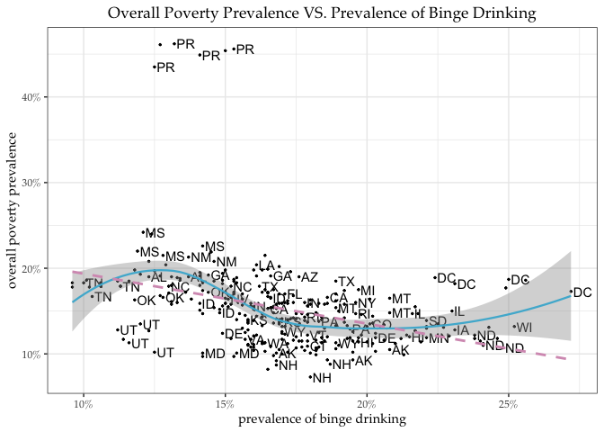

## Selection of Data and Tidying
Save the cleaned dataset as `binge_clean.csv`. That file is included in the uploaded files for homework submission.


## Data Transformation and Summary Results
### 5. Produce a table that shows the overall, female, and male binge drinking prevalences across U.S. States in the most recent year of data for the Top 10 binge drinking states (i.e. the ones with the highest prevalence in the overall population). Use the relevant dplyr commands to  select the right variables, sort the data (arrange()), and filter the data frame.

```r
library(tidyverse)
cdi_tidy <- read_csv('binge_clean.csv')
cdi_tidy%>%dplyr::filter(year == 2016 )%>%
        arrange(desc(binge_all))%>%
        dplyr::select(state, binge_all,binge_female,binge_male)%>%
        top_n(10,binge_all)
```

```
## # A tibble: 10 x 4
##    state                binge_all binge_female binge_male
##    <chr>                    <dbl>        <dbl>      <dbl>
##  1 District of Columbia      25.6         21.3       30.5
##  2 North Dakota              24.8         17.2       32.1
##  3 Wisconsin                 24.6         19.5       29.7
##  4 Minnesota                 21.3         16.2       26.5
##  5 Iowa                      21.2         15.4       27.1
##  6 Guam                      20.7         11.2       29.8
##  7 Nebraska                  20           13.1       27.2
##  8 Illinois                  19.9         14.5       25.6
##  9 Pennsylvania              19.4         13.8       25.3
## 10 South Dakota              19.3         14.3       24.3
```

### 6. Make a simple scatter plot showing the correlation between the overall poverty prevalence in a state and the prevalence of binge drinking in the overall population. I suggest to use ggplot. Add a loess smoothed fit curve (use geom_smooth in the ggplot2 package) to indicate the pattern. Comment briefly.


```r
cdi_tidy%>%ggplot(aes(x= binge_all, y = poverty, 
                      label = stateabb )) +
        geom_point(size = 0.5) + 
        geom_text(check_overlap = TRUE, hjust = -0.05, nudge_x = 0.05)+
        geom_smooth(size = 0.8, colour = '#4EB6D4')+
        geom_smooth(method='lm', formula =  y ~ x, 
                    se = FALSE, colour = '#D69CBE', linetype = 2)+
        ggtitle("Overall Poverty Prevalence VS. Prevalence of Binge Drinking")+
        xlab("prevalence of binge drinking")+
        ylab("overall poverty prevalence")+
        scale_x_continuous(labels = function(x) paste0(x, "%"))+
        scale_y_continuous(labels = function(y) paste0(y, "%"))+
        theme_bw(base_size = 11, base_family = "Palatino")+
        theme(plot.title = element_text(hjust = 0.5))
```

<!-- -->

*Comment*: Overall, there is a slight negative association between the overall poverty prevalence in a state and the prevalence of binge drinking in the overall population. However, the variance in poverty prevalence of extrem high and low binge drinking state are larger than the variance in poverty prevalence of medium binge drinking state.


```r
model <- lm( poverty ~ binge_all , data = cdi_tidy)
library(olsrr)
olsrr::ols_test_breusch_pagan(model)
```

```
## 
##  Breusch Pagan Test for Heteroskedasticity
##  -----------------------------------------
##  Ho: the variance is constant            
##  Ha: the variance is not constant        
## 
##                Data                 
##  -----------------------------------
##  Response : poverty 
##  Variables: fitted values of poverty 
## 
##          Test Summary           
##  -------------------------------
##  DF            =    1 
##  Chi2          =    52.78089 
##  Prob > Chi2   =    3.729128e-13
```

By the Breush-Pagan test we can see the heteroscedasticity in `poverty ~ binge_all` model. Therefore, it is hard to draw inference from a simple linear model between this two variable.
